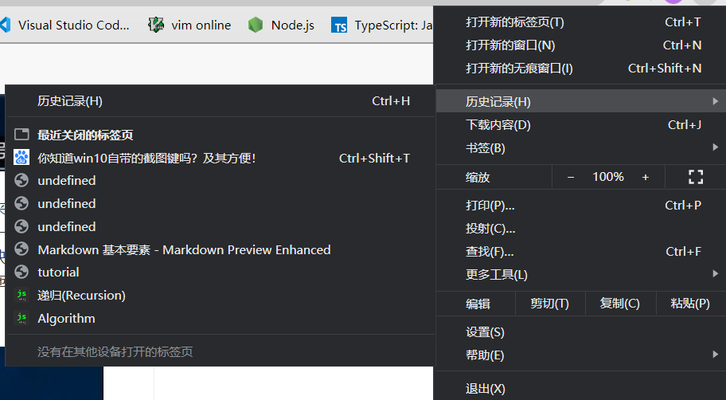
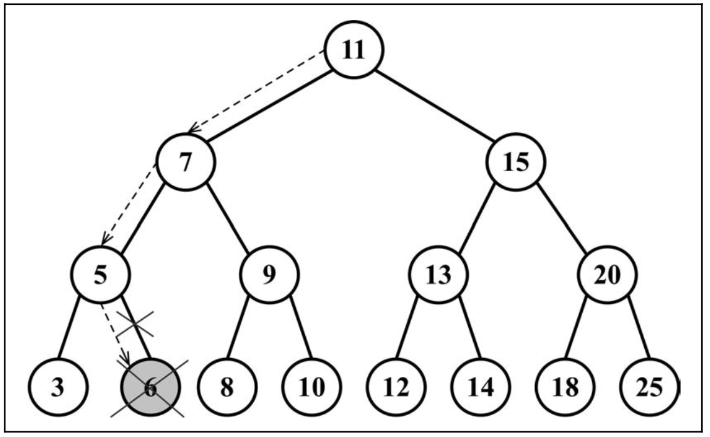
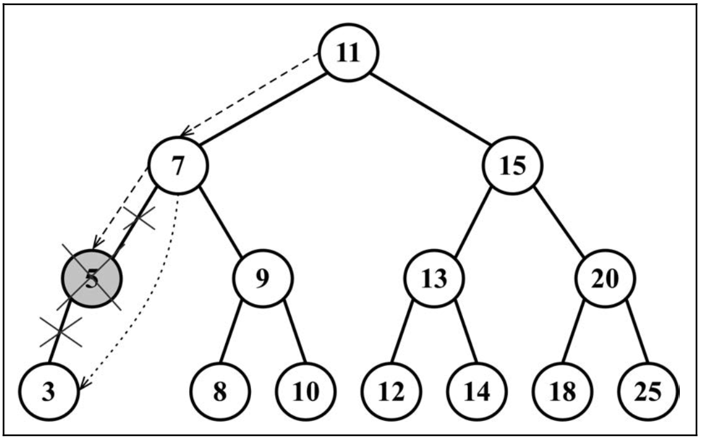

<!--ppt-->

theme:moon

<!--page-->

## 树（Tree）

### 李艳生
### 湖北师范大学
### 物理与电子科学学院
### 2020年春季

<!--page-->

## 回顾

- *非线性数据结构*
    - **数组**（随机访问）
    - **栈**（后进先出）
    - **队列**（先进先出）
    - **链表**（增删方便）
    - **集合**（不重复性）
    - **字典**（键值对）
    - **散列表**（查找高效）

<!--page-->

## 引入


家谱

<!--page-->

## 引入


目录

<!--page-->

## 引入



菜单

<!--page-->

## 树的概念


<!--page-->

## 树的概念

- **树**：包含一系列*父子关系*的节点。
- **节点**：只有一个*父节点*和0个或多个*子节点*
- **根节点**：没有父节点
- **叶子节点**：没有子节点
- **子树**：由节点和它的子孙节点组成
- **节点的深度**：祖先节点的个数
- **树的高度**：所有节点深度的最大值


<!--page-->

## 二叉树

- 二叉树Binary Tree
    - 每个节点**最多**只有**两个**子节点
    - 即左子节点和右子节点


<!--page-->

## 二叉搜索树

- 二叉搜索树Binary Search Tree
    - 左节点存储比它小的值
    - 右节点存储比它大的值


<!--page-->

## 二叉搜索树操作

- 创建
- 插入
- 查找
- 删除
- 遍历
- 找最大值、最小值

<!--page-->

## 创建


<!--page-->

## 创建节点

- 存储节点值，并要指向左子节点和右子节点

```javascript
class Node {   
    constructor(key) {     
        this.key = key; // 节点值    
        this.left = null; // 指向左子节点    
        this.right = null; // 指向右子节点  
    } 
}
```

<!--page-->

## 创建树

- 链表创建头结点对象，头结点head属性指向链表第一个节点
- 树创建一个对象,对象root属性指向树的根节点

<!--page-->

## 创建树

```javascript
function defaultCompare(a, b) {
  if (a === b) {
    return 0;
  }
  return a < b ? -1 : 1;
}

class BinarySearchTree {
    constructor(compareFn = defaultCompare) {     
        this.compareFn = compareFn; // 用来比较节点值    
        this.root = null; //  指向Node类型的根节点  
    }
    insert(key){}
    search(key){}
    remove(key){}
    inOrderTraverse(){}
    preOrderTraverse(){}
    postOrderTraverse(){}
    min(){}
    max(){} 
} 
```

<!--page-->

## 插入

- 第一步是如果树为空，即root为null,创建一个根节点，并用root指向它。
- 第二步是将节点添加到根节点以外的其他位置。

<!--page-->

## 插入

```javascript
insert(key) {
  if (this.root == null) { //树为空
    this.root = new Node(key); //插入根节点
  } else {
    this.insertNode(this.root, key); //插入其它位置
  }
}
insertNode(node, key) {
  if (this.compareFn(key, node.key) === -1) { //key < node.key
    if (node.left == null) {
      node.left = new Node(key);
    } else {
      this.insertNode(node.left, key); //递归插入左子树
    }
  } else if (node.right == null) { //node右子节点为空
    node.right = new Node(key); //插入右子节点位置
  } else {
    this.insertNode(node.right, key); //递归插入右子树
  }
}
```
<!--page-->

## 插入使用

```javascript
//创建一个树对象
const tree = new BinarySearchTree(); 
//插入一个值
tree.insert(7); 
tree.insert(15); 
tree.insert(5); 
tree.insert(3); 
tree.insert(9); 
tree.insert(8); 
tree.insert(10); 
tree.insert(13); 
tree.insert(12); 
tree.insert(14); 
tree.insert(20); 
tree.insert(18); 
tree.insert(25);
tree.insert(6)
```

<!--page-->

## 插入使用


<!--page-->

## 树的遍历

> 遍历一棵树是指访问树的每个节点并对它们进行某种操作的过程
>> 中序遍历  
>> 先序遍历  
>> 后序遍历  

<!--page-->

## 中序遍历

- 左子节点--节点--右子节点，即从小到大顺序访问

```javascript
inOrderTraverse(callback) {
  this.inOrderTraverseNode(this.root, callback);
}

inOrderTraverseNode(node, callback) {
  if (node != null) {
    this.inOrderTraverseNode(node.left, callback); //递归左子节点
    callback(node.key); //访问节点
    this.inOrderTraverseNode(node.right, callback); //递归右子节点
  }
}
```

<!--page-->

## 中序遍历的使用

```javascript
//定义一个访问函数
const printNode = (value) => console.log(value); 
//中序遍历
tree.inOrderTraverse(printNode);
```

<!--page-->

## 中序遍历的使用


<!--page-->

## 先序遍历

- 节点--左子节点--右子节点，即优先后代节点访问

```javascript
preOrderTraverse(callback) {
  this.preOrderTraverseNode(this.root, callback);
}
preOrderTraverseNode(node, callback) {
  if (node != null) {
    callback(node.key); //访问节点
    this.preOrderTraverseNode(node.left, callback);//递归左子节点
    this.preOrderTraverseNode(node.right, callback);//递归右子节点
  }
}
```

<!--page-->

## 先序遍历的使用

```javascript
//定义一个访问函数
const printNode = (value) => console.log(value); 
//先序遍历
tree.preOrderTraverse(printNode);
```

<!--page-->

## 先序遍历的使用


<!--page-->

## 后序遍历

- 左子节点--右子节点--节点，即优先访问后代节点

```javascript
postOrderTraverse(callback) {
  this.postOrderTraverseNode(this.root, callback);
}
postOrderTraverseNode(node, callback) {
  if (node != null) {
    this.postOrderTraverseNode(node.left, callback);//递归左子节点
    this.postOrderTraverseNode(node.right, callback);//递归右子节点
    callback(node.key); //访问节点
  }
}
```

<!--page-->

## 后序遍历的使用

```javascript
//定义一个访问函数
const printNode = (value) => console.log(value); 
//先序遍历
tree.preOrderTraverse(printNode);
```

<!--page-->

## 后序遍历的使用


<!--page-->

## 搜索最大值最小值


<!--page-->

## 搜索最小值

- 找最左边的叶子节点即为最小值

```javascript
min() {
  return this.minNode(this.root);
}
minNode(node) {
  let current = node;
  //找最左边的叶子节点
  while (current != null && current.left != null) {
    current = current.left;
  }
  return current;
}
```

<!--page-->

## 搜索最大值

- 找最右边的叶子节点即为最小值

```javascript
max() {
  return this.minNode(this.root);
}
maxNode(node) {
  let current = node;
  //找最左边的叶子节点
  while (current != null && current.right != null) {
    current = current.right;
  }
  return current;
}
```

<!--page-->

## 搜索特定值

```javascript
search(key) {
  return this.searchNode(this.root, key);
}

searchNode(node, key) {
  if (node == null) {
    return false;
  }
  if (this.compareFn(key, node.key) === -1) { //key < node.key
    return this.searchNode(node.left, key); //搜索左子树
  } if (this.compareFn(key, node.key) === 1) { //key > node.key
    return this.searchNode(node.right, key); //搜索右子树
  }
  return true;
}
```

<!--page-->

## 删除

- 第一步，找到要删除的节点
- 第二步，删除该节点，分三种情况
    - 该节点为叶子节点时，node = null,直接删除即可
    - 该节点只有一个子节点时，父节点指向子节点即可
    - 该节点有两个子节点时，分三步
        - 第一步找到该节点右子树上最小值节点
        - 第二步将最小值节点值赋给该节点
        - 第三步删除该节点右子树上最小值节点

<!--page-->

## 删除叶节点



<!--page-->

## 只有一个子节点



<!--page-->

## 有两个子节点


<!--page-->

## 删除

```javascript
remove(key) {
    this.root = this.removeNode(this.root, key);
}
removeNode(node, key) {
    //没找到
    if (node == null) {
        return undefined;
    }
    //查找节点
    if (this.compareFn(key, node.key) === Compare.LESS_THAN) {
        node.left = this.removeNode(node.left, key);
        return node;
    } if (this.compareFn(key, node.key) === Compare.BIGGER_THAN) {
        node.right = this.removeNode(node.right, key);
        return node;
    }
    // 删除该节点
    // 叶子节点
    if (node.left == null && node.right == null) {
        node = undefined;
        return node;
    }
    // 只有一个子节点
    if (node.left == null) {
        node = node.right;
        return node;
    } if (node.right == null) {
        node = node.left;
        return node;
    }
    // 有两个子节点
    const aux = this.minNode(node.right);
    node.key = aux.key;
    node.right = this.removeNode(node.right, aux.key);
    return node;
}
```

<!--page-->

## 任务

> 设计一个二叉搜索树，向树中插入1,2,3,4,5,6,7,8,9,10,分别用先序、中序、后序方式遍历该树。


